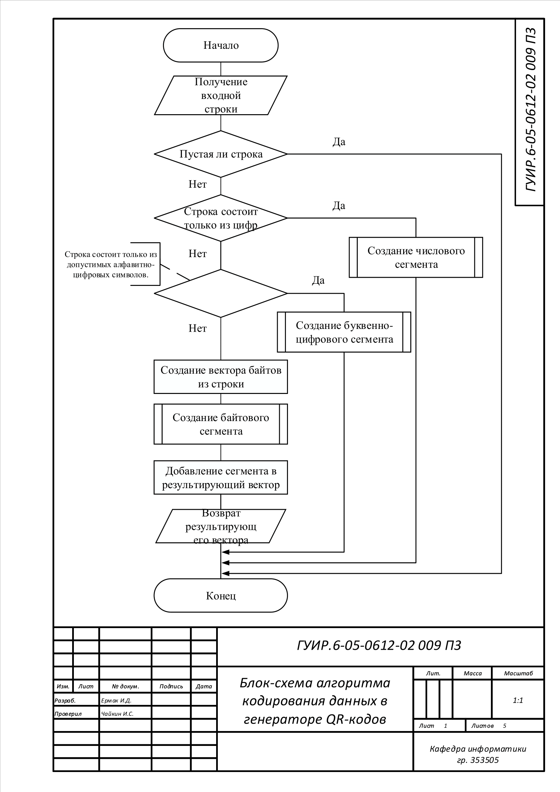
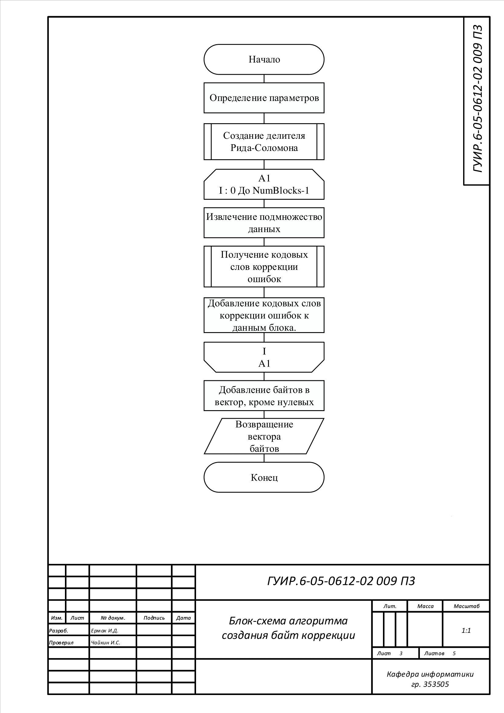
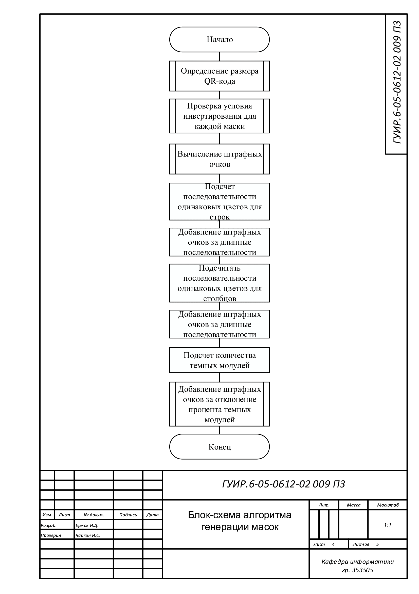

# РАЗРАБОТКА ГРАФИЧЕСКОГО ПРИЛОЖЕНИЯ, ГЕНЕРИРУЮЩЕГО QR-КОДЫ
___
Приложение поддерживает числовое и буквенно-числовое кодирование. Также при таком кодировании возможно закодировать URL адрес, номер телефона, e-mail адрес, визитку. Чтобы закодировать информацию, ее необходимо ввести в соответствующее поле. Для генерации QR-кодадостаточно ввести любое сообщение в поле ввода текста и нажать кнопку
___
## Блок-схема алгоритма кодирования данных в генераторе QR-кодов
Применяется в: `Fundamentals-of-algorithmization-and-programming/353505/Ермак И.Д./Курсовая работа/CourseWork/qrsegment.cpp` в методах QVector<QrSegment> QrSegment::buildSegments(const QChar *text), QrSegment QrSegment::createAlphanumericSegment(const QChar *text), QrSegment QrSegment::createByteSegment(const QVector<uint8_t> &data) QrSegment QrSegment::createNumericSegment(const QChar *text), bool QrSegment::isAlphanumericFormat(const QChar *text), bool QrSegment::isNumericFormat(const QChar *text), результат работы обрабатывается в методе void QrCode::QrCode(uint version, Ecc errorCorrectionLevel, const QVector<uint8_t> &codewords, int mask)

___
## Блок-схема алгоритма создания и кодирования сегментов QR-кода
Применяется в: `Fundamentals-of-algorithmization-and-programming/353505/Ермак И.Д./Курсовая работа/CourseWork/qrcode.cpp` в методах QrCode QrCode::encodeSegments(const QVector<QrSegment> &segs, Ecc ecl, uint minVersion, uint maxVersion, int mask), int QrCode::getNumCodewords(int ver, Ecc ecl) результат работы обрабатывается в методе void MainWindow::on_pushButton_clicked()

___
## Блок-схема алгоритма создания байт коррекции
Применяется в: `Fundamentals-of-algorithmization-and-programming/353505/Ермак И.Д./Курсовая работа/CourseWork/qrcode.cpp` в методах QVector<uint8_t> QrCode::SetupEccAndInterleave(const QVector<uint8_t> &data), QVector<uint8_t> QrCode::reedSolomonComputeDivisor(int degree), QVector<uint8_t> QrCode::reedSolomonComputeRemainder(const QVector<uint8_t> &data, const QVector<uint8_t> &divisor) результат работы обрабатывается в методе QrCode::QrCode(uint version, Ecc errorCorrectionLevel, const QVector<uint8_t> &codewords, int mask)

___
## Блок-схема алгоритма генерации масок
Применяется в: `Fundamentals-of-algorithmization-and-programming/353505/Ермак И.Д./Курсовая работа/CourseWork/qrcode.cpp` в методах long QrCode::getPenaltyScore(), int QrCode::finderPenaltyCountPatterns(const std::array<int,7> &sequenceLengths) результат работы обрабатывается в методе QrCode::QrCode(uint version, Ecc errorCorrectionLevel, const QVector<uint8_t> &codewords, int mask)

___
## Блок-схема алгоритма создания образа QR-кода
Применяется в: `Fundamentals-of-algorithmization-and-programming/353505/Ермак И.Д./Курсовая работа/CourseWork/qrcode.cpp` в методах void QrCode::SetupFormatBits(int msk), void QrCode::SetupVersion(), void QrCode::SetupFindPattern(int x, int y), void QrCode::SetupAlignPattern(int x, int y), void QrCode::setFunctionModule(int x, int y, bool isDark) результат работы обрабатывается в методе QrCode::QrCode(uint version, Ecc errorCorrectionLevel, const QVector<uint8_t> &codewords, int mask)

___
